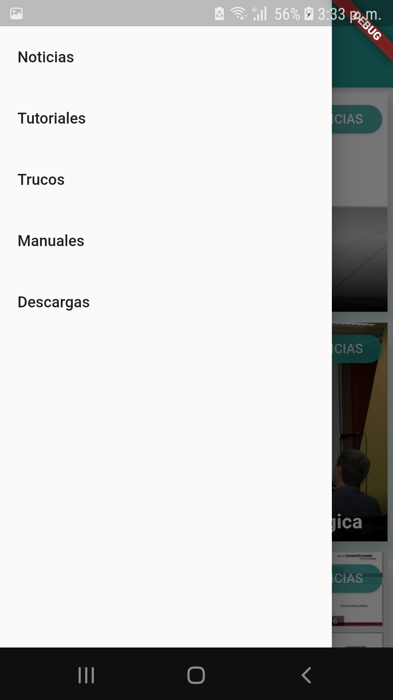
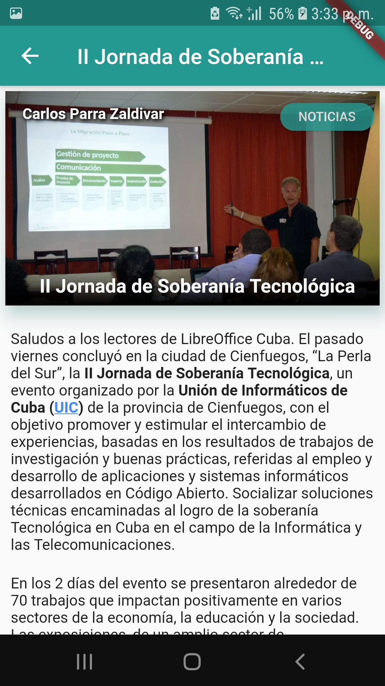
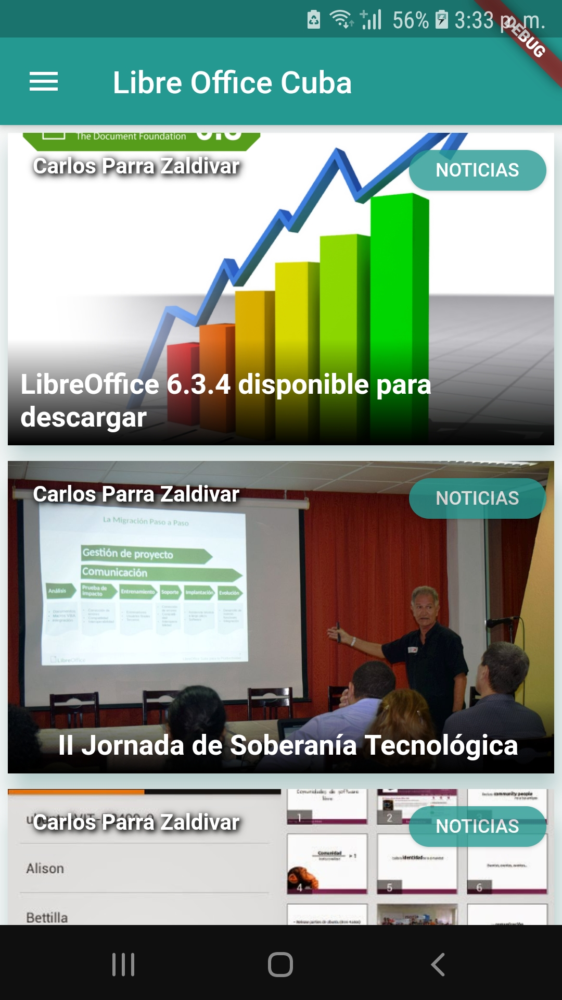
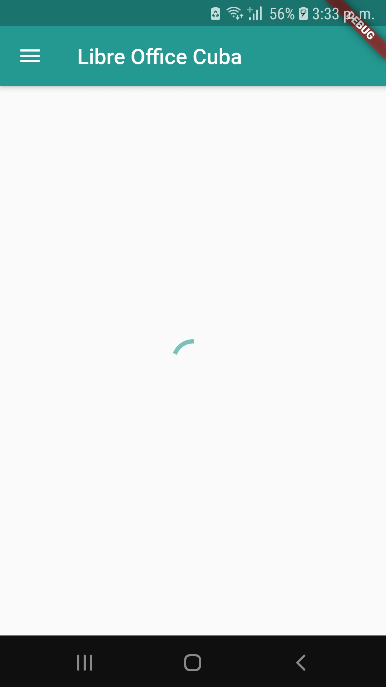

# Aplicación de WordPress con Flutter

> Aplicación nativa IOS / Android para el sitio web / blog de WordPress creado con Flutter. No se requieren complementos adicionales para WordPress.

> Hospital Lucia 2019







## Prerequisites
Estos son los requisitos para ejecutar esta aplicación
- Flutter versión 1.9 o posterior
- WordPress 4.7 o posterior

## Getting Started
Clonar este Repo
```
git clone https://github.com/cubanitoalex/libreoffice-blog-cubava-Flutter.git 
```
Cambiar <code>TITLE</code> y <code>URL</code> de acuerdo a su sitio web en <code>lib/config.dart</code> file.

Es así de simple.

## Caracteristicas
- [x] Últimas publicaciones
- [x] Página de lista de publicaciones de categoría única
- [x] Desplazamiento infinito con paginación
- [x] Página de detalles de la publicación
- [x] Top 15 categorías en cajones
- [x] Imagen desvanecida con marcador de posición
- [] Estado de conectividad, si fuera de línea, aparece un mensaje
- [] Tire para actualizar
- [] Página de configuración
- [] Publicaciones relacionadas en la página de detalles de la publicación
- [] Integración OneSignal para notificaciones push
- [ ] Pantalla de bienvenida
- [] Pantalla de la página de Categorías de Niza
- [] Compartir y botones favoritos

## Meta

Alexis Parra– [@cubanito_alex](https://twitter.com/cubanito_alex) – alexiparra@gmail.com


[https://github.com/cubanitoalex/libreoffice-blog-cubava-Flutter](https://github.com/cubanitoalex/libreoffice-blog-cubava-Flutter)


